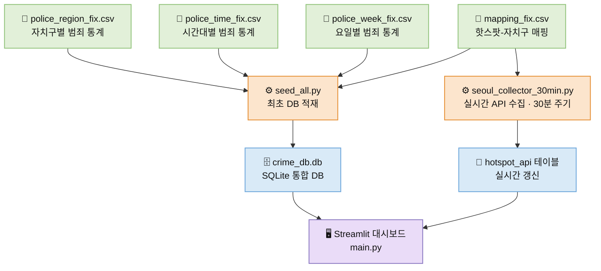

# 📊 서울 도시안전 분석 대시보드

### 서울 범죄 통계와 실시간 혼잡도를 결합한 도시 안전 분석 프로젝트

서울 도시안전 분석 대시보드는 서울시 범죄 통계 데이터와 서울시 HOTSPOT API를 결합해
**시간대, 요일, 지역, 실시간 혼잡도**를 한눈에 확인할 수 있도록 만든
**Streamlit 기반 위험도 분석 대시보드**입니다.

기존의 정적 통계 자료가 보여주기 어려웠던
**"언제, 어디가, 얼마나 위험한지"**를 더 직관적으로 전달하는 것을 목표로 했습니다.

---

## 1. 프로젝트 개요

* **프로젝트명**: 서울 도시안전 분석 대시보드
* **주제**: 서울 범죄 데이터 기반 실시간 위험도 분석 대시보드
* **목표**

  * 지역별 범죄 현황 시각화
  * 시간대별 / 요일별 범죄 패턴 분석
  * 서울시 실시간 혼잡도 데이터와 결합한 위험도 확인
  * 사용자가 더 직관적으로 안전 정보를 이해할 수 있는 대시보드 구현

---

## 2. 팀원 소개

| 이름  | 역할 | GitHub                             |
| :-- | :- | :--------------------------------- |
| 양하준 | 팀장 | [YangHaJun](https://github.com/dpgns9983-dot) |
| 류동현 | 팀원 | [RyuDongHyeon](https://github.com/RyuGPT1) |
| 이지양 | 팀원 | [LeeJiYang](https://github.com/jiyang-lee) |
| 류혜인 | 팀원 | [RyuHyeIn](https://github.com/rhi020409-ship-it) |

---

## 3. 주요 기능

### 1) 지역별 범죄 분석

* 서울시 구별 범죄 데이터를 시각화
* 지도 기반으로 지역별 위험도를 직관적으로 비교 가능
* 범죄 발생 건수를 공간적으로 확인할 수 있도록 구성

### 2) 시간대별 범죄 분석

* 시간대별 범죄 발생 추이를 확인
* 특정 시간대에 집중되는 범죄 패턴을 시각화
* 비교 카드 및 차트를 통해 위험 시간대를 빠르게 파악 가능

### 3) 요일별 범죄 분석

* 요일별 범죄 발생 건수를 분석
* 주중 / 주말 범죄 패턴 차이를 확인
* 평균 대비 위험도를 함께 보여주어 해석이 쉽도록 구성

### 4) 실시간 핫스팟 분석

* 서울시 HOTSPOT API를 활용해 실시간 혼잡도 데이터 반영
* 특정 지역의 혼잡도와 안전 정보를 함께 확인 가능
* 정적 통계와 실시간 데이터를 함께 보여주는 페이지 구성

---

## 4. 서비스 활용 대상

서울 도시안전 분석 대시보드는 일반 시민이 수시로 직접 조회하는 서비스라기보다, 도시 안전과 공간 운영 의사결정에 참고할 수 있는 **분석형 대시보드**를 목표로 합니다.

주요 활용 대상은 다음과 같습니다.

* **도시 안전 관리자 및 행정 담당자** : 지역별 범죄 패턴과 실시간 혼잡도를 함께 참고하여 위험지역 관리 및 대응 우선순위를 설정할 수 있습니다.
* **행사·공간 운영 관리자** : 유동인구가 많은 지역의 혼잡도와 위험지수를 함께 확인하여 현장 운영 판단에 참고할 수 있습니다.
* **데이터 분석 학습자 및 프로젝트 평가자** : 공공데이터와 실시간 데이터를 결합한 시각화 및 서비스 설계 사례를 학습할 수 있습니다.

---

## 5. 사용 데이터

본 프로젝트는 전처리된 범죄 통계 데이터와 서울시 핫스팟 데이터를 활용합니다.

* `police_region_fix.csv`
  → 지역별 범죄 데이터
* `police_time_fix.csv`
  → 시간대별 범죄 데이터
* `police_week_fix.csv`
  → 요일별 범죄 데이터
* `mapping_fix.csv`
  → 범죄 데이터와 핫스팟 지역 매핑용 데이터
* `서울시_122개_hotspot.csv`
  → 서울시 주요 핫스팟 정보
* `서울시_122개_geodata.csv`
  → 지도 시각화를 위한 좌표 데이터

---

## 6. 프로젝트 구조

```
project_1_crime_stats_final/
├── 1_preprocessing/      # 데이터 전처리 노트북
├── 2_eda/                # 탐색적 데이터 분석
├── 3_orm/                # ORM 설계 및 테스트
├── 4_streamlit/
│   ├── data/             # 전처리 데이터
│   ├── orm/              # SQLAlchemy ORM
│   ├── pages/            # Streamlit 페이지
│   ├── seed/             # DB 시딩 및 API 수집 스크립트
│   ├── static/           # 정적 파일
│   └── main.py           # Streamlit 앱 실행 파일
├── main.py               # 루트 실행용 엔트리포인트
├── requirements.txt
└── README.md
```

---

## 7. 기술 스택

* **Language**

  * `Python 3.12` : 데이터 수집, 분석, 웹 애플리케이션 개발 전반에 걸친 메인 언어로 사용했습니다.

* **Data Processing & Analysis**

  * `pandas` & `numpy` : 범죄 통계 테이블 전처리, 수치 연산, 집계 로직 구현에 활용했습니다.
  * `SQLAlchemy` : ORM 기반 DB 설계를 통해 데이터 일관성과 확장성을 확보했습니다.

* **Dashboard & Visualization**

  * `streamlit` : Python 코드만으로 인터랙티브한 웹 대시보드를 빠르게 구축하기 위해 사용했습니다.
  * `plotly` : 동적 차트와 인터랙티브 시각화 구성에 활용했습니다.
  * `pydeck` : 지도 기반 시각화와 공간 정보 표현에 활용했습니다.
  * `matplotlib` : 기본 통계 그래프와 보조 시각화에 활용했습니다.

* **Database**

  * `SQLite` : 별도 서버 없이 파일 기반으로 운영 가능한 경량 DB로 채택했습니다.

* **Package Manager**

  * `uv` 또는 `pip` : 패키지 설치 및 가상환경 관리에 활용했습니다.

* **External API**

  * `Seoul HOTSPOT API` : 서울시 주요 지역의 실시간 혼잡도 및 도시 데이터를 수집하는 데 활용했습니다.

--- | :--- |
| Language | Python |
| Data Processing | Pandas, NumPy |
| Database | SQLite, SQLAlchemy ORM |
| Visualization | Streamlit, Plotly, Pydeck, Matplotlib |
| External API | Seoul HOTSPOT API |

---

## 7. 주요 데이터 속성

| 테이블명             | 설명                            |
| :--------------- | :---------------------------- |
| `region_master`  | 자치구명, 고유 ID                   |
| `crime_category` | 범죄 대분류 / 중분류                  |
| `crime_region`   | 자치구 ID, 범죄 유형 ID, 발생 건수       |
| `crime_time`     | 시간대(8구간), 범죄 유형 ID, 발생 건수     |
| `crime_week`     | 요일(7일), 범죄 유형 ID, 발생 건수       |
| `hotspot_api`    | 장소명, 혼잡도, 최소/최대 인구, 기온, 수집 시각 |
| `region_mapper`  | 핫스팟 ID와 자치구 ID 연결             |

---

## 8. 데이터 처리 과정

### 1) 전처리

* 원본 CSV / Excel 데이터 정리
* 불필요한 열 제거
* 문자열 정리 및 컬럼명 통일
* wide 형식 데이터를 long 형식으로 변환
* 분석 및 DB 적재에 적합한 `_fix` 데이터 생성

### 2) 분석

* 요일별 / 시간대별 / 지역별 범죄 패턴 확인
* 평균 대비 위험도 계산
* 시각화에 필요한 파생 지표 생성

### 3) DB 적재

* SQLAlchemy ORM 모델 설계
* SQLite 데이터베이스 생성
* 전처리 데이터를 테이블별로 시딩

### 4) 대시보드 구현

* Streamlit 기반 멀티페이지 대시보드 구성
* 분석 결과를 차트, 카드, 지도 형태로 시각화
* 실시간 HOTSPOT API 데이터 반영

---

## 9. 데이터 처리 흐름



---

## 10. 대표 분석 요소

### 지역별 분석

* 자치구별 범죄 발생 현황 비교
* 지도 기반 분포 확인
* 특정 지역 위험도 상대 비교

### 시간대별 분석

* 범죄 발생이 집중되는 시간대 파악
* 시간대별 증감 패턴 시각화
* 주요 시간 구간 비교

### 요일별 분석

* 요일별 범죄 발생 패턴 비교
* 주중과 주말 차이 확인
* 평균 대비 위험도 분석

### 실시간 핫스팟 분석

* 실시간 혼잡도 데이터 반영
* 핫스팟별 현재 상태 확인
* 범죄 통계와 실시간 데이터의 연결 분석

---

## 11. 프로젝트 화면 구성

* **Main**

  * 프로젝트 소개 및 전체 기능 안내

* **지역별 분석 페이지**

  * 서울시 구별 범죄 현황 시각화
  * 지도 기반 위험도 확인

* **시간대별 분석 페이지**

  * 시간대별 범죄 발생 패턴 시각화
  * 위험 시간대 비교

* **요일별 분석 페이지**

  * 요일별 범죄 건수 및 위험도 분석

* **핫스팟 페이지**

  * 실시간 혼잡도 데이터 반영
  * 혼잡도와 범죄 통계를 함께 확인

---

## 12. 프로젝트에서 중점적으로 구현한 부분

### 1) 정적 통계 + 실시간 데이터 결합

기존 범죄 통계만 보여주는 데서 끝나지 않고,
실시간 혼잡도 데이터를 함께 연결해 더 현실적인 위험도 정보 확인이 가능하도록 구현했습니다.

### 2) CSV → ORM → Streamlit 파이프라인 구축

단순 시각화에 그치지 않고,
전처리부터 DB 적재, 대시보드 연결까지의 흐름을 직접 설계했습니다.

### 3) 사용자 친화적인 시각화

숫자만 나열하지 않고,
차트 / 카드 / 지도 형태로 구성해 사용자가 빠르게 정보를 이해할 수 있도록 했습니다.

---

## 13. 실행 방법

### 1) 저장소 클론

```
git clone https://github.com/jiyang-lee/project_1_crime_stats_final.git
cd project_1_crime_stats_final
```

### 2) 가상환경 생성 및 활성화

```
python -m venv .venv
```

#### Windows

```
.venv\Scripts\activate
```

#### macOS / Linux

```
source .venv/bin/activate
```

### 3) 패키지 설치

```
pip install -r requirements.txt
```

### 4) 데이터베이스 시딩

```
python -m 4_streamlit.seed.seed_all
```

### 5) Streamlit 실행

```
streamlit run main.py
```

---

## 14. 트러블슈팅

### 1) 데이터 형식 불일치 문제

* 원본 데이터의 컬럼 구조와 문자열 형식이 일정하지 않아 전처리 과정이 필요했습니다.
* 컬럼 정리, 문자열 trim, long format 변환을 통해 해결했습니다.

### 2) 지역 매핑 문제

* 범죄 데이터의 지역명과 핫스팟 데이터의 지역명이 완전히 일치하지 않는 문제가 있었습니다.
* 별도 매핑 테이블을 만들어 연결 구조를 정리했습니다.

### 3) 실행 경로 / 모듈 인식 문제

* Streamlit 실행 위치에 따라 ORM 모듈을 찾지 못하는 문제가 있었습니다.
* 루트 엔트리포인트를 분리해 실행 경로를 표준화했습니다.

### 4) 실시간 데이터 반영 문제

* 실시간 API 데이터는 키 설정과 갱신 흐름 관리가 중요했습니다.
* 환경변수 / secrets 기반으로 API 키를 관리하고, 수집 스크립트를 별도로 구성했습니다.

---

## 15. 회고

이번 프로젝트를 통해 단순한 데이터 시각화를 넘어서,
**전처리 → 분석 → DB 설계 → 대시보드 구현**까지 이어지는 전체 흐름을 경험할 수 있었습니다.

특히 다음과 같은 점을 배울 수 있었습니다.

* 데이터 구조를 일관되게 정리하는 전처리의 중요성
* ORM을 활용한 데이터 관리 방식
* Streamlit을 활용한 빠른 대시보드 프로토타이핑
* 실시간 API와 통계 데이터를 함께 연결하는 방법
* 사용자가 이해하기 쉬운 시각화 설계의 중요성

---

## 16. 향후 개선 방향

* 위험도 산정 로직 고도화
* 더 다양한 실시간 외부 데이터 연동
* 지도 시각화 정교화
* 사용자 맞춤형 필터 기능 확대
* 배포 및 자동 갱신 파이프라인 안정화

---

## 17. 데이터 출처

### 1) 경찰청 범죄 발생 및 지역 데이터

* **출처** : 경찰청 범죄 통계
* **주소** : 지역 - [https://www.data.go.kr/data/3074462/fileData.do](https://www.data.go.kr/data/3074462/fileData.do)
* **설명** : 지역별 범죄 발생 건수 데이터의 참고 및 전처리 기준 자료

### 2) 경찰청 범죄 발생 및 시간대·요일 데이터

* **출처** : 경찰청 범죄 통계
* **주소** : 시간대 및 요일 - [https://www.data.go.kr/data/3074459/fileData.do](https://www.data.go.kr/data/3074459/fileData.do)
* **설명** : 시간대별·요일별 범죄 발생 건수 데이터의 참고 및 전처리 기준 자료

### 3) 서울시 실시간 도시데이터 유동인구 측정 정보

* **출처** : 서울 열린데이터광장
* **주소** : [https://data.seoul.go.kr/dataList/OA-21285/F/1/datasetView.do](https://data.seoul.go.kr/dataList/OA-21285/F/1/datasetView.do)
* **설명** : 서울시 주요 지점의 실시간 유동인구 및 혼잡도 관련 데이터 활용

---

## 18. 한 줄 소개

**서울 도시안전 분석 대시보드는 서울시 범죄 통계와 실시간 혼잡도 데이터를 결합해, 더 직관적인 도시 위험도 정보를 제공하는 데이터 기반 대시보드 프로젝트입니다.**
